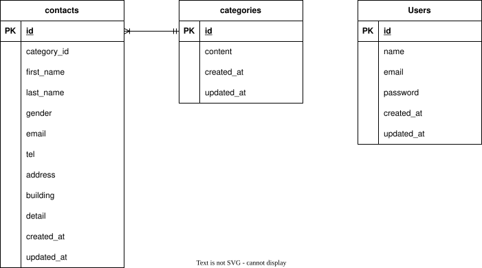

# お問い合わせフォーム

## 環境構築
### Dockerビルド
1. git clone https://github.com/ainyan4645/contact-form__test.git
2. cd contact-form__test
3. docker-compose up -d --build

### Laravel環境構築
1. cd src
2. cp .env.example .env
3. docker-compose exec php bash
4. composer install
5. php artisan key:generate
6. php artisan migrate
7. php artisan db:seed

 ※permissionエラーが出る場合は `/contact-form__test` ディレクトリで以下のコマンドを実行してください。
 ```bash
 sudo chmod -R 777 src/*
 ```

## 使用技術(実行環境)
- php 8.2
- Laravel 8.0
- MySQL 8.0
- nginx 1.24

## ER図


## URL
- お問い合わせフォーム： http://localhost/
- 登録ページ：http://localhost/register
- phpMyAdmin： http://localhost:8080/

